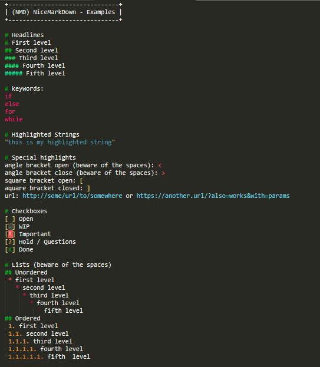

# (NMD) NiceMarkdown

This is a Sublime Text 3 package, that gives you a new Syntax Highlighting, called "NiceMarkdown".

## Dependencies
* PackageControl https://packagecontrol.io/installation

## Installation
1. Open PackageControl (ctrl+shift+p or on Mac: cmd+shift+p)
2. Type "Add repository"
3. Type the url: https://github.com/LupusCoding/sublime-nmd
4. Open PackageControl again (see step 1)
5. Type "Install Package"
6. Select "NiceMarkdown"

## Highlighting Features
* 5 levels of Headlines
* 5 levels of unordered lists
* 5 levels of ordered lists
* Checkbox markup
* keywords: if, else, for, while
* brackets: < > [ ]
* quoted strings
* urls

